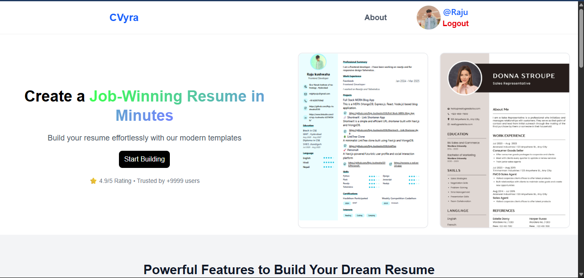
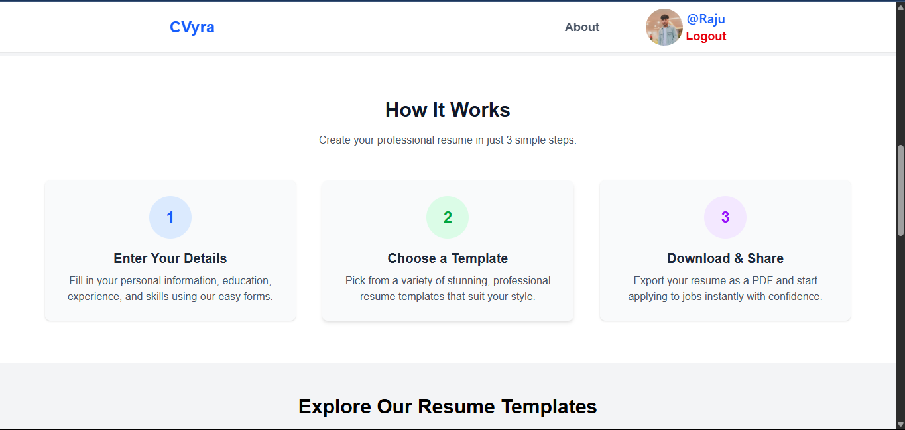
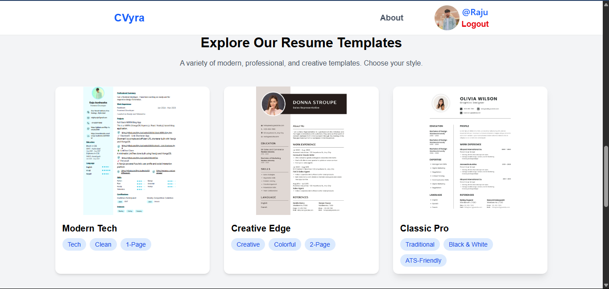
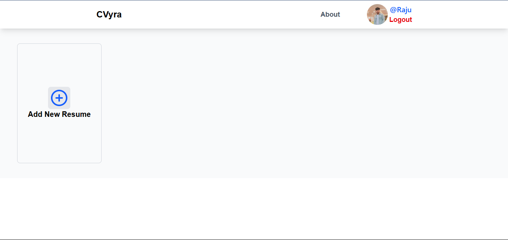
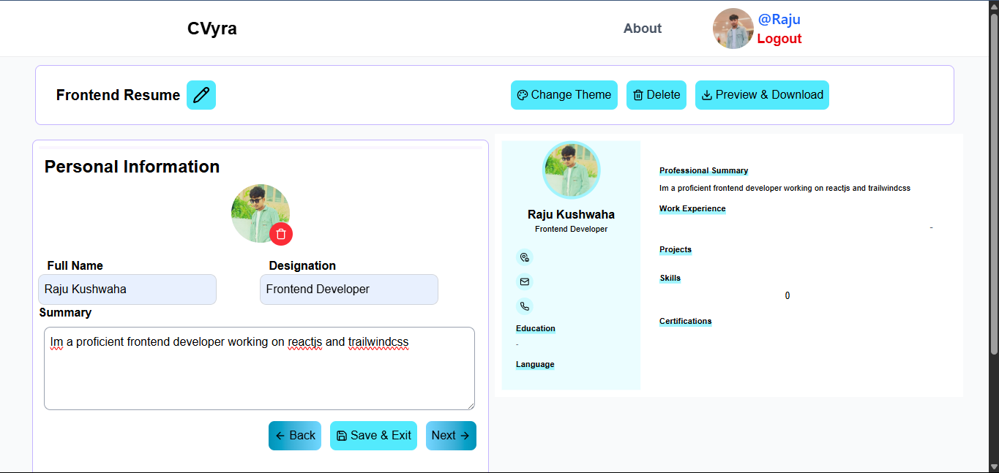
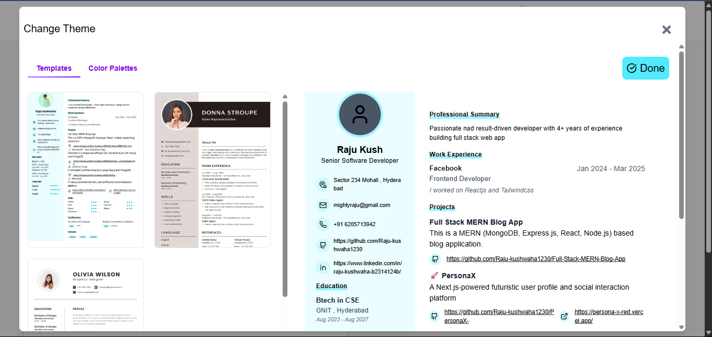
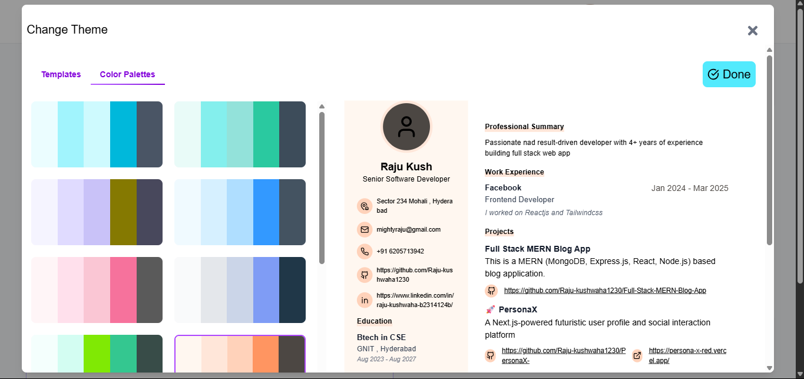
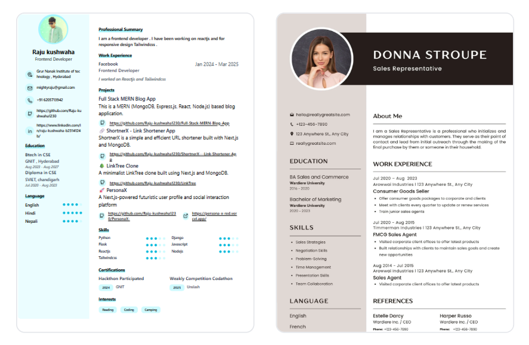

# 📝 Resume Builder

A dynamic and modern Resume Builder application built using the **MERN** stack:
- **Frontend**: React.js (Vite)
- **Backend**: Node.js + Express.js
- **Database**: MongoDB (via Mongoose)
- **Cloud Storage**: Cloudinary for image uploads

> 📌 This application allows users to create, preview, and download stylish resumes. Users can also upload profile pictures and generate thumbnails of their resume in real-time.

---

## 🔗 Live Demo

🌐  [https://your-frontend.vercel.app](https://c-vyra.vercel.app/)  


---

## 📸 Screenshots

### 🧾 Landing Page





### Add Title


### 🧾 Resume Editing Page

### Change Theme Page

### Change Color Paletes


### 👤 Profile Upload and Preview


---

## 📦 Tech Stack

### Frontend:
- [React.js](https://reactjs.org/)
- [Vite](https://vitejs.dev/)
- [Tailwind CSS](https://tailwindcss.com/)
- [html2canvas](https://www.npmjs.com/package/html2canvas) (for thumbnail generation)
- [Axios](https://axios-http.com/)

### Backend:
- [Node.js](https://nodejs.org/)
- [Express.js](https://expressjs.com/)
- [Mongoose](https://mongoosejs.com/)
- [Cloudinary SDK](https://www.npmjs.com/package/cloudinary)
- [Multer](https://www.npmjs.com/package/multer) for file uploads

---

## 📁 Folder Structure

```bash
├── frontend/                # Frontend (React)
│   ├── public/
│   └── src/
│       ├── assets/
│       ├── components/
│       ├── context/
│       ├── pages/
│       ├── utils/
│       └── App.jsx
├── backend/                # Backend (Node/Express)
│   ├── config/
│   ├── controllers/
│   ├── middlewares/
│   ├── models/
│   ├── routes/
│   └── index.js
│   
├── .env
├── README.md


⚙️ Features
📄 Create and edit resumes

🖼️ Upload and preview profile picture (stored in Cloudinary)

📷 Capture resume as image thumbnail

💾 Autosave and update data in MongoDB

⬇️ Download or view resume preview

✅ Clean and responsive UI

🚀 Getting Started
1. Clone the repository

```
    git clone https://github.com/your-username/resume-builder.git
    cd resume-builder

```

2. Setup the Backend
```
    cd server
    npm install

```
 Configure .env
 ---
```
    PORT=5000
    MONGO_URI=your_mongo_connection_string
    CLOUDINARY_CLOUD_NAME=your_cloud_name
    CLOUDINARY_API_KEY=your_api_key
    CLOUDINARY_API_SECRET=your_api_secret
```
``` 
    npm run start
 ```

 3. Setup the Frontend
```
    cd client
    npm install
    npm run dev

```

🛠️ Contributions
Contributions are welcome! Feel free to open issues or pull requests.


🙋‍♂️ Author
Made with ❤️ by Raju
📧 Email: mightyrajukushwaha@gmail.com
📱 Mobile: 
